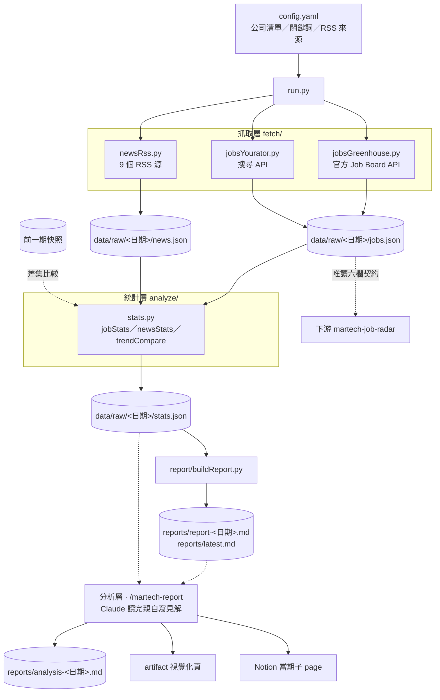

# 架構

單向管線，四層，層與層之間只傳資料不傳物件：**抓取 → 統計 → 報告 → （分析層）**。
前三層是機械層，全部由 `run.py` 串起來，可排程自動跑；第四層需要模型在場。

## 系統架構圖

## 模組職責

| 模組 | 職責 | 不負責 |
|------|------|--------|
| `run.py` | 決定執行日期、串起三層、寫快照與報告；入口設 `socket.setdefaulttimeout(30)`（`feedparser` 不吃 timeout 參數） | 任何判讀 |
| `fetch/jobsGreenhouse.py` | Appier 全球職缺，官方 API，含 JD 內文與 `first_published` | 台灣以外的過濾 |
| `fetch/jobsYourator.py` | 台灣新創職缺，依公司 slug ＋產業關鍵詞兩種查法 | 判斷公司是否為 MarTech 本業 |
| `fetch/newsRss.py` | 9 個 RSS 源，依 `maxAgeDays` 過期、依 `newsTopics` 打主題標記；`keepAll` 源不經關鍵詞過濾 | **把已滑出 feed 的文章找回來**（見下方限制） |
| `analyze/stats.py` | 職缺分類與技能頻率、主題聲量、與前一期快照的差集比較 | 解釋數字的意義 |
| `report/buildReport.py` | 繁中 markdown 統計報告，每節附判讀指引 | 見解 |
| 分析層（`/martech-report`） | 跨來源見解、對求職的意涵、artifact、Notion | 產生任何數字 |

## 資料流與識別鍵

| 資料 | 識別鍵 | 跨期比較是否成立 |
|------|--------|------------------|
| 職缺 | `jobId`（Greenhouse／Yourator 的平台編號） | ✅ 成立。同一個職缺改標題不會產生新 id，2026-08-10 實測到一例（`gh-6820898`）確認差集不會被騙 |
| 新聞 | `link` | ❌ **不成立**，見下 |

### 已知限制：新聞是「每期重抽」，不是累積

`fetch/newsRss.py` 只遍歷 `feedparser.parse(url).entries`，也就是 feed **當下**的內容。
`maxAgeDays` 只能把太舊的剔除，**沒有任何機制能找回已經滑出 feed 的文章**，
也沒有跨期累積的儲存。多數來源一次只回傳 10 篇，所以每期語料的分母
幾乎等於各 feed 長度的總和，內容則整批換掉。

2026-08-10 實測的相鄰兩期文章重疊數：9、13、4、6（分母 31～66）。
**因此 `stats.json` 的 `topicDelta` 不能當趨勢讀**，它是兩批幾乎不相交樣本之間的差。
要修得把新聞改成累積式儲存（維護一個 news store，每期併入新抓到的、依 `maxAgeDays` 過期），
這會讓歷史快照無法直接沿用，屬於需要先立決策的改動。

## 對下游的契約

`data/raw/<日期>/jobs.json` 是給 `martech-job-radar` 的**唯讀對外契約**，
六個欄位：`company` / `title` / `area` / `link` / `appearDate` / `source`。
下游不 import 本專案的模組、不改 `config.yaml`；**欄位改動需通知下游**。

## 技術棧

- Python 3.12、venv（`.venv/`，不進 git）
- 相依只有三個：`requests`（HTTP）、`feedparser`（RSS）、`pyyaml`（設定）
- 無資料庫：所有狀態就是 `data/raw/<日期>/` 底下的 JSON 快照，進 git 當跨期比較基準
- 排程：macOS launchd（`scripts/install-schedule.sh`），每 3 天跑機械層並桌面通知
